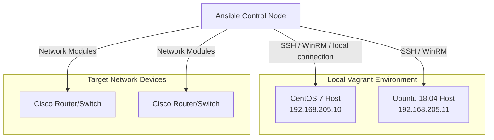

---

  

---

**Comprehensive guide and practical laboratory for Network Automation using Ansible**. This repository provides step-by-step examples from basic inventory management to advanced concepts like Ansible Vault, custom Cisco modules, and AWX integration.

It is designed to help Network Engineers and DevOps professionals build, manage, and scale network infrastructure configurations through code.

## Use Case
This repository serves as a learning path and reference implementation for organizations and individuals transitioning to network automation. By showcasing practical use cases—such as configuration backups, Jinja2 templating, conditional loops, and role-based execution—it provides a solid foundation for automating routine network tasks and managing complex environments securely.

## Minimum Requirements
To build and execute the playbooks in this project, the following minimum requirements must be met:
- **Ansible:** `>= 2.9` installed on your control node.
- **Vagrant:** `>= 1.6.0` for local virtualized testing environments.
- **Hypervisor:** VirtualBox or VMware Fusion (for Vagrant to spin up VMs).
- **System:** A Unix-like terminal (Linux/macOS) or WSL for Windows users.

## Architecture


## Tech Stack
- **Automation Tool:** Ansible
- **Virtualization & Testing:** Vagrant, VirtualBox/VMware
- **Target OS:** CentOS 7, Ubuntu 18.04, Cisco IOS/NX-OS

## Features
- **Progressive Learning Path:** Numbered directories (`1-basic` to `10-ansible-awx`) guiding from simple playbooks to enterprise tooling.
- **Cisco Network Automation:** Dedicated modules (`3-cisco_module`, `5-cisco-cfg-backup`) for configuring and backing up Cisco network devices.
- **Security Best Practices:** Demonstrates secure variable management using `7-ansible-vault`.
- **Advanced Control Structures:** Implementations of Jinja2 (`2-templates`), conditional logic, loops (`4-loop-condition`), and regular expressions (`8-regex`).
- **Scalable Architecture:** Proper `6-inventory-layout` and structured `9-roles` for reusable and scalable automation.
- **Enterprise Ready:** Introduction to enterprise automation workflows using `10-ansible-awx`.

## Project Structure
```text
.
├── 1-basic/                  # Basic Ansible concepts, playbooks, and inventory management
├── 2-templates/              # Working with Jinja2 templates for dynamic configuration
├── 3-cisco_module/           # Configuring Cisco network devices using native modules
├── 4-loop-condition/         # Control structures: conditional logic and iterative loops
├── 5-cisco-cfg-backup/       # Automated backup workflows for Cisco device configurations
├── 6-inventory-layout/       # Advanced and structured inventory management
├── 7-ansible-vault/          # Encrypting sensitive data and secrets with Ansible Vault
├── 8-regex/                  # Using Regular Expressions for text parsing and extraction
├── 9-roles/                  # Modularizing tasks using Ansible Roles
├── 10-ansible-awx/           # Enterprise execution utilizing Ansible AWX
├── setup.sh                  # Bootstrap script for dependencies and configuration
├── Vagrantfile               # Vagrant configuration for local testing VMs (CentOS/Ubuntu)
└── README.md                 # Project documentation
```

## Step-by-Step Execution Guide
Follow these steps to set up the local test environment and begin executing the playbooks:

### 1. Clone the Repository
Open your terminal and clone the repository, then navigate into the project directory:
```bash
git clone https://github.com/mpandey95/ansible-for-network-automation.git
cd ansible-for-network-automation
```

### 2. Set Up Local Testing Environment
Initialize the local Vagrant environment to spin up the target hosts:
```bash
vagrant up
```
This command reads the `Vagrantfile` and provisions a CentOS 7 host (`192.168.205.10`) and an Ubuntu 18.04 host (`192.168.205.11`), automatically configuring SSH access for Ansible connectivity.

### 3. Bootstrap Dependencies (Optional)
Run the setup script if you need to install initial system dependencies for your execution environment (note: check the script before execution as it targets yum-based systems):
```bash
chmod +x setup.sh
sudo ./setup.sh
```

### 4. Execute Playbooks
Navigate to the specific topic directory and run playbooks as needed. For example, to run the basic playbooks:
```bash
cd 1-basic
# Review the inventory and playbook first
ansible-playbook -i inventory/hosts playbook.yml
```

Explore other directories (e.g., `cd 5-cisco-cfg-backup`) similarly based on the topics you want to execute or test.

## Testing & Troubleshooting
To verify your connectivity and setup:
1. Ensure the Vagrant VMs are successfully running using `vagrant status`.
2. Test Ansible connectivity to your vagrant hosts:
   ```bash
   ansible all -i 1-basic/inventory/hosts -m ping
   ```
3. If connecting to physical network devices (e.g., Cisco routers), verify network reachability and SSH credentials.

## Cleanup Procedures
To remove the local Vagrant virtual machines and free up resources:
```bash
vagrant destroy -f
```

---

**Manish Pandey** — Senior DevOps/Platform Engineer

### 🛠️ Technology Stack
#### ☁️ Cloud & Platforms


#### ⚙️ Platform & DevOps


#### 🔐 Security & Ops


#### 🧑‍💻 Programming


#### 💾 Database


### Connect With Me
- **GitHub:** [@mpandey95](https://github.com/mpandey95)
- **LinkedIn:** [manish-pandey95](https://linkedin.com/in/manish-pandey95)
- **Email:** <mnshkmrpnd@gmail.com>

### License
See **LICENSE** | Support: [GitHub](https://github.com/mpandey95) • [LinkedIn](https://linkedin.com/in/manish-pandey95)
